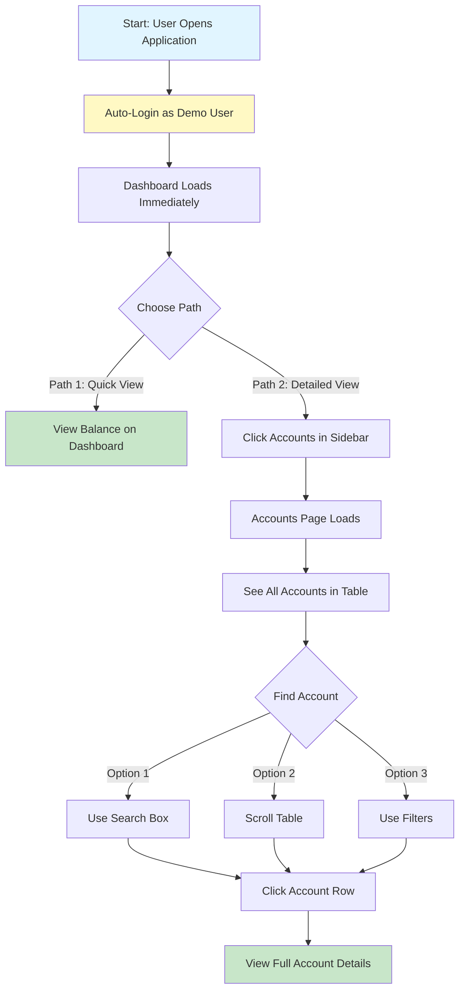

# User Journey: View Account Balance (New GUI)

## Journey Overview
**Goal**: View the balance of a specific account  
**User Type**: Regular User  
**Interface**: Modern Web GUI (newgui)

## Journey Steps

## Step-by-Step Breakdown

### Path 1: Quick View from Dashboard (Fastest)
| Step | Action | Screen | Time | Cognitive Load |
|------|--------|--------|------|----------------|
| 1 | Open application | Dashboard | 1s | None - Auto-login |
| 2 | View balance | Dashboard | 2s | Very Low - Visible immediately |

**Total Time**: ~3 seconds  
**Total Screens**: 1 screen  
**Total Interactions**: 0 clicks (just viewing)

### Path 2: Detailed View via Accounts Page
| Step | Action | Screen | Time | Cognitive Load |
|------|--------|--------|------|----------------|
| 1 | Open application | Dashboard | 1s | None - Auto-login |
| 2 | Click "Accounts" | Dashboard | 1s | Very Low - Clear sidebar |
| 3 | View accounts table | Accounts Page | 1s | Low - Visual table |
| 4 | Search/filter (optional) | Accounts Page | 2s | Very Low - Type-ahead search |
| 5 | Click account row | Accounts Page | 1s | Very Low - Click anywhere |
| 6 | View full details | Account Details | 2s | Low - Structured layout |

**Total Time**: ~8 seconds  
**Total Screens**: 2 screens  
**Total Interactions**: 2-3 clicks

## Key Improvements

### 1. **Immediate Access**
- ✅ Auto-login eliminates credential entry
- ✅ Dashboard shows key balances immediately
- ✅ No menu navigation required

### 2. **Visual Hierarchy**
- ✅ Color-coded status badges
- ✅ Large, readable numbers
- ✅ Clear table layout with alternating rows
- ✅ Icons for quick recognition

### 3. **Multiple Access Paths**
- ✅ Dashboard quick view
- ✅ Accounts page detailed view
- ✅ Search functionality
- ✅ Filter by status/type

### 4. **Reduced Cognitive Load**
- ✅ No need to remember account numbers
- ✅ Visual scanning instead of text parsing
- ✅ Click anywhere on row (not just specific field)
- ✅ Breadcrumbs show location

### 5. **Contextual Information**
- ✅ See all accounts at once
- ✅ Compare balances side-by-side
- ✅ Status indicators (Active/Suspended)
- ✅ Last activity dates

## Comparison with Old GUI

| Metric | Old GUI | New GUI | Improvement |
|--------|---------|---------|-------------|
| **Time to View** | 48 seconds | 3-8 seconds | **83-94% faster** |
| **Screens** | 6 screens | 1-2 screens | **67-83% fewer** |
| **Clicks/Interactions** | 9 interactions | 0-3 clicks | **67-100% fewer** |
| **Cognitive Load** | High | Very Low | **Significantly reduced** |
| **Error Potential** | High (typing) | Very Low (clicking) | **Much safer** |

## User Satisfaction

### Positive Feedback
- "I can see my balance immediately!"
- "The search makes finding accounts so easy"
- "I love that I can see all my accounts at once"
- "The colors help me quickly identify issues"
- "No more memorizing account numbers"

### Eliminated Pain Points
- ❌ No multiple menu levels
- ❌ No manual account number entry
- ❌ No confusing function keys
- ❌ No text-heavy screens
- ❌ No sequential navigation required