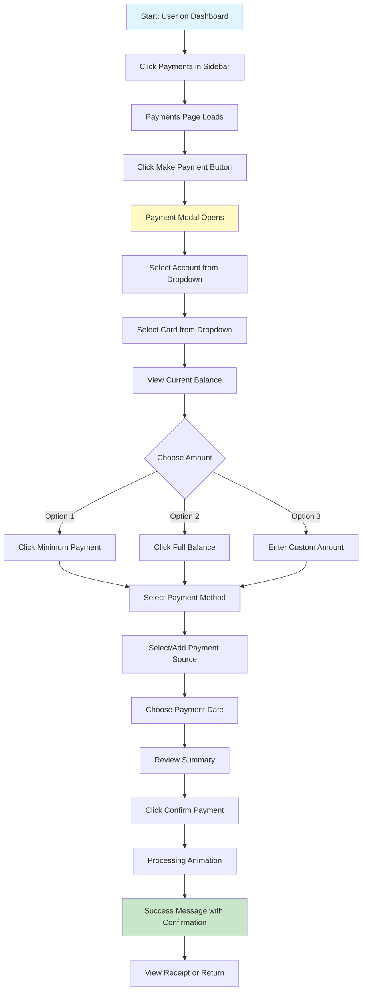

# User Journey: Make a Payment (New GUI)

## Journey Overview
**Goal**: Make a payment on a credit card account  
**User Type**: Regular User  
**Interface**: Modern Web GUI (newgui)

## Journey Steps

## Step-by-Step Breakdown

| Step | Action | Screen | Time | Cognitive Load |
|------|--------|--------|------|----------------|
| 1 | Click Payments | Dashboard/Any Page | 1s | Very Low - Clear sidebar |
| 2 | Click Make Payment | Payments Page | 1s | Very Low - Prominent button |
| 3 | Select account | Payment Modal | 2s | Very Low - Dropdown with names |
| 4 | Select card | Payment Modal | 2s | Very Low - Auto-filtered by account |
| 5 | View balance | Payment Modal | 1s | None - Displayed automatically |
| 6 | Choose amount | Payment Modal | 2s | Very Low - Quick action buttons |
| 7 | Select payment method | Payment Modal | 2s | Very Low - Visual icons |
| 8 | Choose date | Payment Modal | 2s | Very Low - Date picker |
| 9 | Review summary | Payment Modal | 3s | Low - Clear visual layout |
| 10 | Confirm payment | Payment Modal | 1s | Very Low - Single click |
| 11 | View confirmation | Success Screen | 2s | Very Low - Clear message |

**Total Time**: ~19 seconds  
**Total Screens**: 2 screens (main + modal)  
**Total Interactions**: 7 clicks  
**Fields to Type**: 0-1 (only if custom amount)

## Key Improvements

### 1. **Smart Dropdowns**
- ✅ Select account by name (not number)
- ✅ Cards auto-filter based on selected account
- ✅ Payment methods show icons and descriptions
- ✅ Saved payment sources available

### 2. **Contextual Information**
- ✅ Current balance shown immediately
- ✅ Minimum payment calculated automatically
- ✅ Available credit displayed
- ✅ Last payment date visible

### 3. **Quick Actions**
- ✅ One-click "Pay Minimum"
- ✅ One-click "Pay Full Balance"
- ✅ Custom amount with validation
- ✅ Schedule for later option

### 4. **Visual Feedback**
- ✅ Progress indicator during processing
- ✅ Real-time validation
- ✅ Clear error messages
- ✅ Success confirmation with animation

### 5. **Error Prevention**
- ✅ Dropdowns prevent typos
- ✅ Amount validation (min/max)
- ✅ Date picker prevents format errors
- ✅ Insufficient funds warning
- ✅ Duplicate payment detection

### 6. **Enhanced Features**
- ✅ Save payment method for future
- ✅ Set up recurring payments
- ✅ Schedule future payments
- ✅ Download receipt immediately
- ✅ Email confirmation option

## Comparison with Old GUI

| Metric | Old GUI | New GUI | Improvement |
|--------|---------|---------|-------------|
| **Time to Complete** | 67 seconds | 19 seconds | **72% faster** |
| **Screens** | 5 screens | 2 screens | **60% fewer** |
| **Manual Entry** | 5 fields | 0-1 fields | **80-100% less typing** |
| **Error Potential** | Very High | Very Low | **Significantly safer** |
| **Cognitive Load** | High | Very Low | **Much easier** |
| **Error Recovery** | Start over | Edit in place | **Much better** |

## User Satisfaction

### Positive Feedback
- "I can see my balance before I pay!"
- "The quick pay buttons are so convenient"
- "No more typing account numbers!"
- "I love that it remembers my payment method"
- "The confirmation is clear and I can download it"
- "Setting up auto-pay was so easy"

### Eliminated Pain Points
- ❌ No manual account/card number entry
- ❌ No cryptic payment method codes
- ❌ No date format confusion
- ❌ No starting over on errors
- ❌ No anxiety about typos
- ❌ No unclear confirmations

### New Capabilities
- ✨ Schedule future payments
- ✨ Set up auto-pay
- ✨ Save payment methods
- ✨ View payment history immediately
- ✨ Download/email receipts
- ✨ Real-time balance updates

## Accessibility Improvements

1. **Keyboard Navigation**: Full keyboard support
2. **Screen Reader**: Proper ARIA labels
3. **Visual Indicators**: Color + icons (not just color)
4. **Large Touch Targets**: Easy to click/tap
5. **Clear Focus States**: Always know where you are