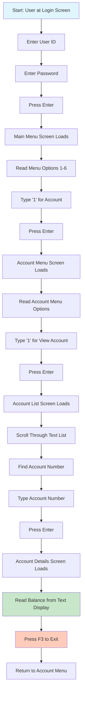

# User Journey: View Account Balance (Old GUI)

## Journey Overview
**Goal**: View the balance of a specific account  
**User Type**: Regular User  
**Interface**: Mainframe-style Terminal (carddemo-web)

## Journey Steps

## Step-by-Step Breakdown

| Step | Action | Screen | Time | Cognitive Load |
|------|--------|--------|------|----------------|
| 1 | Enter credentials | Login Screen | 10s | Low |
| 2 | Navigate to Main Menu | Main Menu | 5s | Medium - Must read all options |
| 3 | Select Account option | Main Menu | 3s | Low |
| 4 | Navigate to Account Menu | Account Menu | 5s | Medium - Must read submenu |
| 5 | Select View Account | Account Menu | 3s | Low |
| 6 | View account list | Account List | 10s | High - Text-heavy, must scan |
| 7 | Enter account number | Account List | 5s | Medium - Must type accurately |
| 8 | View account details | Account Details | 5s | Medium - Parse text layout |
| 9 | Exit back to menu | Account Details | 2s | Low |

**Total Time**: ~48 seconds  
**Total Screens**: 6 screens  
**Total Interactions**: 9 interactions

## Pain Points

1. **Multiple Menu Levels**: User must navigate through 2 menu levels
2. **Text-Heavy Interface**: All information presented as plain text
3. **Manual Entry Required**: Must type account number from memory or list
4. **No Visual Hierarchy**: All text looks the same, hard to scan
5. **Sequential Navigation**: Must go through each screen in order
6. **Function Key Usage**: F3 to exit is not intuitive
7. **No Search**: Cannot search for account by name or partial number
8. **Limited Context**: Cannot see other accounts while viewing one

## User Frustrations

- "Why do I need to go through so many menus?"
- "I can't remember my account number"
- "The text all looks the same"
- "I wish I could just click on the account"
- "Going back is confusing with F3"