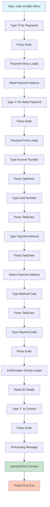

# User Journey: Make a Payment (Old GUI)

## Journey Overview
**Goal**: Make a payment on a credit card account  
**User Type**: Regular User  
**Interface**: Mainframe-style Terminal (carddemo-web)

## Journey Steps

## Step-by-Step Breakdown

| Step | Action | Screen | Time | Cognitive Load |
|------|--------|--------|------|----------------|
| 1 | Navigate to Payments | Main Menu | 3s | Low |
| 2 | Select Make Payment | Payment Menu | 5s | Medium - Read options |
| 3 | Enter account number | Payment Form | 8s | High - Must remember/lookup |
| 4 | Enter card number | Payment Form | 10s | High - 16 digits, no formatting |
| 5 | Enter payment amount | Payment Form | 5s | Medium - Must type carefully |
| 6 | Select payment method | Payment Form | 8s | High - Must know codes |
| 7 | Enter payment date | Payment Form | 6s | Medium - Format: MM/DD/YYYY |
| 8 | Review confirmation | Confirmation Screen | 10s | High - Must verify all fields |
| 9 | Confirm payment | Confirmation Screen | 2s | Low |
| 10 | Wait for processing | Processing | 3s | Low |
| 11 | View result | Success Screen | 5s | Medium - Parse text |
| 12 | Exit to menu | Success Screen | 2s | Low |

**Total Time**: ~67 seconds  
**Total Screens**: 5 screens  
**Total Interactions**: 12 interactions  
**Fields to Type**: 5 fields (all manual entry)

## Pain Points

1. **Manual Data Entry**: Must type account and card numbers from memory
2. **No Validation**: Errors only caught after submission
3. **Code-Based Selection**: Payment methods use codes (1=Bank, 2=Card, etc.)
4. **Date Format Confusion**: Must enter date in specific format
5. **No Auto-Fill**: Cannot select from existing accounts/cards
6. **Sequential Process**: Cannot skip or go back easily
7. **No Visual Feedback**: No indication of progress
8. **Error Recovery**: If error occurs, must start over
9. **No Save Draft**: Cannot save partially completed payment
10. **Confirmation Anxiety**: Must carefully verify all typed data

## Common Errors

1. **Typo in Account Number**: Wrong account charged
2. **Card Number Mistake**: Payment fails
3. **Amount Format Error**: Decimal point issues
4. **Invalid Date Format**: Must re-enter
5. **Wrong Payment Method Code**: Payment routed incorrectly

## User Frustrations

- "I have to look up my account number every time"
- "Why can't I just select my card from a list?"
- "I'm afraid I'll make a typo and pay the wrong amount"
- "The confirmation screen is hard to read"
- "If I make a mistake, I have to start all over"
- "I wish I could see my balance before paying"
- "The date format is confusing"