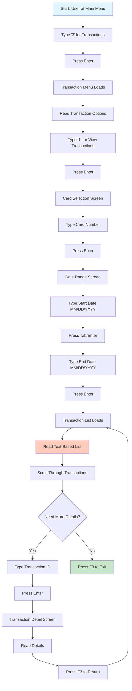

# User Journey: View Transaction History (Old GUI)

## Journey Overview
**Goal**: View recent transactions for a credit card  
**User Type**: Regular User  
**Interface**: Mainframe-style Terminal (carddemo-web)

## Journey Steps

## Step-by-Step Breakdown

| Step | Action | Screen | Time | Cognitive Load |
|------|--------|--------|------|----------------|
| 1 | Navigate to Transactions | Main Menu | 3s | Low |
| 2 | Select View Transactions | Transaction Menu | 5s | Medium - Read options |
| 3 | Enter card number | Card Selection | 10s | High - 16 digits, no formatting |
| 4 | Enter start date | Date Range | 6s | Medium - Format: MM/DD/YYYY |
| 5 | Enter end date | Date Range | 6s | Medium - Format: MM/DD/YYYY |
| 6 | Wait for list to load | Processing | 3s | Low |
| 7 | Read transaction list | Transaction List | 15s | Very High - Dense text |
| 8 | Scroll through list | Transaction List | 10s | High - No visual hierarchy |
| 9 | Find specific transaction | Transaction List | 8s | High - All text looks same |
| 10 | Enter transaction ID | Transaction List | 5s | Medium - Must type accurately |
| 11 | View details | Detail Screen | 8s | High - Parse text layout |
| 12 | Return to list | Detail Screen | 2s | Low |

**Total Time**: ~81 seconds (for viewing and one detail)  
**Total Screens**: 6 screens  
**Total Interactions**: 12 interactions  
**Manual Entry**: 3 fields (card number, 2 dates)

## Pain Points

1. **Card Number Entry**: Must type full 16-digit number
2. **Date Format Confusion**: MM/DD/YYYY format not intuitive
3. **No Default Dates**: Cannot quickly view "last 30 days"
4. **Text-Heavy Display**: All transactions in plain text
5. **No Visual Hierarchy**: Cannot quickly scan for important info
6. **Limited Information**: Must drill into each transaction for details
7. **No Filtering**: Cannot filter by amount, merchant, or type
8. **No Search**: Cannot search for specific merchant
9. **Sequential Navigation**: Must go back and forth to see details
10. **No Export**: Cannot download or print transaction list

## Common User Tasks & Difficulties

### Task 1: Find a Specific Purchase
- Must remember approximate date
- Must scroll through entire list
- All transactions look the same
- Time: ~2-3 minutes

### Task 2: Check Recent Activity
- Must enter today's date and 30 days ago
- Must calculate date range manually
- Time: ~1-2 minutes

### Task 3: Verify a Payment
- Must know exact transaction date
- Must enter date range
- Must scroll to find payment
- Time: ~2-3 minutes

### Task 4: Review Monthly Spending
- Must enter month start/end dates
- Cannot see totals or categories
- Must manually add up amounts
- Time: ~5-10 minutes

## User Frustrations

- "Why do I have to type my card number every time?"
- "I can never remember the date format"
- "The list is so hard to read"
- "I wish I could just search for the merchant name"
- "Why can't I see the last 30 days by default?"
- "I can't tell which transactions are pending"
- "There's no way to export this for my records"
- "I have to click into each transaction to see details"
- "I can't filter by amount or type"
- "The text all blends together"